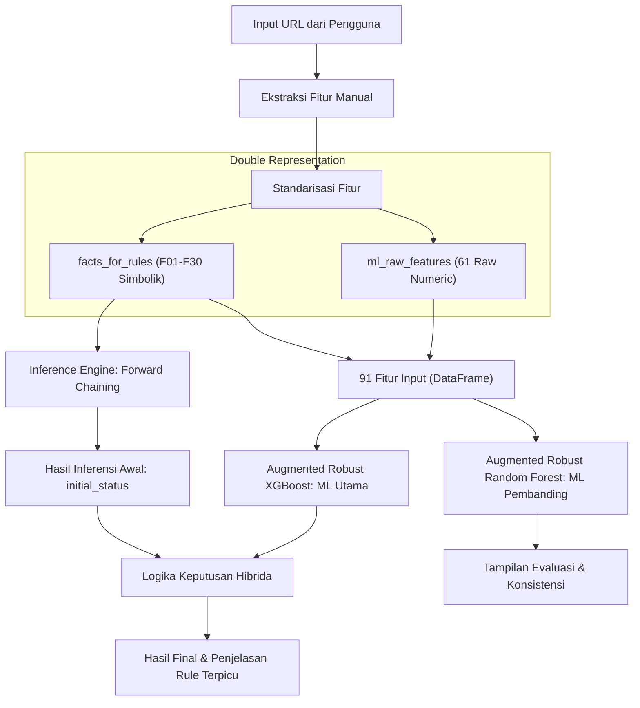

# Backend Runtime Model Architecture & Hybrid Flow

Dokumen ini menjelaskan arsitektur model runtime backend, detail 91 fitur (augmented), alur deteksi `/api/detect/`, dan logika keputusan hibrida pada **PhishGuard Expert System**.

---

## 1. Alur Deteksi Hybrid (Expert-System-First)

Sistem ini mendahulukan **Sistem Pakar (Rule-Based System)** sebagai pusat keputusan logis dan benteng pertahanan utama, didukung oleh **Machine Learning (Augmented Robust XGBoost)** untuk klasifikasi akhir yang presisi dan mantap.

### Penjelasan Langkah Alur Deteksi:
1. **Input URL**: Pengguna memasukkan URL melalui antarmuka web.
2. **Ekstraksi Fitur**: Ekstraktor fitur manual akan mengurai URL string serta mengambil informasi eksternal jika diaktifkan.
3. **Double Representation & Resilient Imputation**:
   - Fitur-fitur yang berhasil diekstraksi akan dimasukkan ke dalam *working memory*.
   - Fitur yang gagal diekstraksi karena masalah jaringan/koneksi ditandai sebagai `imputed_unknown` dengan nilai default `0` untuk ML dan tidak akan memicu rule pakar individual F01–F30 untuk menghindari kesalahan inferensi pakar.
4. **Forward Chaining**: Fakta-fakta yang valid dicocokkan dengan basis aturan (*rules.json*) untuk menghasilkan `initial_status` (`legitimate`, `suspicious`, atau `phishing`) beserta daftar aturan yang terpicu.
5. **Machine Learning Inference**:
   - Model **Augmented Robust XGBoost** melakukan prediksi utama.
   - Model **Augmented Robust Random Forest** melakukan prediksi pembanding secara independen (hasilnya tidak memengaruhi keputusan utama, namun ditampilkan sebagai bahan perbandingan).
6. **Hybrid Decision**: Menggabungkan hasil inferensi sistem pakar dengan prediksi XGBoost melalui logika keputusan hybrid.

---

## 2. Logika Keputusan Hibrida (Hybrid Decision Logic)

Berikut adalah matriks keputusan akhir yang menggabungkan status dari Sistem Pakar (`initial_status`) dengan prediksi dari Model ML Utama (`xgb_prediction`):

| Sistem Pakar (`initial_status`) | ML XGBoost (`xgb_prediction`) | Keputusan Final (`final_result`) | Catatan / Rationale |
| :--- | :--- | :--- | :--- |
| **phishing** | *Any* | **phishing** | Sistem pakar memiliki hak veto tinggi jika mendeteksi tanda bahaya mutlak. |
| **suspicious** | **phishing** | **phishing** | Gejala mencurigakan dari pakar diperkuat oleh keyakinan model ML. |
| **legitimate** | **phishing** | **suspicious** | Konflik antara pakar dan ML menghasilkan status *suspicious* (butuh tinjauan). |
| **suspicious** | **legitimate** | **suspicious** | Gejala mencurigakan dari pakar tetap ditandai sebagai *suspicious* meskipun ML menyatakan aman. |
| **legitimate** | **legitimate** | **legitimate** | Kedua sistem sepakat bahwa URL aman. |

---

## 3. Detail 91 Fitur Teraugmentasi (Augmented Features)

Model ML runtime menggunakan total **91 fitur** yang terdiri atas **30 fitur simbolik (F01-F30)** dari sistem pakar dan **61 fitur numerik/raw** yang direproduksi secara manual.

### A. 30 Fitur Simbolik Sistem Pakar (F01–F30)
Setiap fitur ini memiliki nilai diskrit: `1` (Aman / Legitimate), `0` (Mencurigakan / Suspicious / Imputed), atau `-1` (Bahaya / Phishing).
1. **F01** - Having IP Address
2. **F02** - URL Length
3. **F03** - Shortening Service
4. **F04** - Having @ Symbol
5. **F05** - Double Slash Redirecting
6. **F06** - Prefix-Suffix
7. **F07** - Having Subdomain
8. **F08** - SSL Final State
9. **F09** - Domain Registration Length
10. **F10** - Favicon
11. **F11** - Port
12. **F12** - HTTPS Token
13. **F13** - Request URL
14. **F14** - URL of Anchor
15. **F15** - Links in Tags
16. **F16** - SFH (Server Form Handler)
17. **F17** - Submitting to Email
18. **F18** - Abnormal URL
19. **F19** - Redirect
20. **F20** - On MouseOver
21. **F21** - Right Click Disabled
22. **F22** - Pop-Up Window
23. **F23** - IFrame
24. **F24** - Age of Domain
25. **F25** - DNS Record
26. **F26** - Web Traffic
27. **F27** - Page Rank
28. **F28** - Google Index
29. **F29** - Links Pointing to Page
30. **F30** - Statistical Report

### B. 61 Fitur Raw Numerik / Deskriptif
Fitur-fitur tambahan ini memberikan detail numerik yang sangat membantu model ML dalam mendeteksi pola phishing halus:
- **Fitur Panjang & Jumlah**: `length_url`, `length_hostname`, `nb_dots`, `nb_hyphens`, `nb_at`, `nb_qm`, `nb_and`, `nb_or`, `nb_eq`, `nb_underscore`, `nb_tilde`, `nb_percent`, `nb_slash`, `nb_star`, `nb_colon`, `nb_comma`, `nb_semicolon`, `nb_dollar`, `nb_space`, `nb_www`, `nb_com`, `nb_dashes`, `nb_subdomains`, `nb_queries`.
- **Fitur Konten Kata**: `length_words_raw`, `char_repeat`, `shortest_words_raw`, `shortest_word_host`, `shortest_word_path`, `longest_words_raw`, `longest_word_host`, `longest_word_path`, `avg_words_raw`, `avg_word_host`, `avg_word_path`, `phish_hints`.
- **Fitur Domain & Brand**: `domain_in_brand`, `brand_in_subdomain`, `brand_in_path`, `suspecious_tld`, `port`, `tld_in_path`, `tld_in_subdomain`, `abnormal_subdomain`, `count_imputed_unknown`.
- **Fitur Eksternal & Keamanan**: `domain_registration_length`, `domain_age`, `web_traffic`, `dns_record`, `google_index`, `page_rank`.
- **Fitur Dokumen (HTML & Links)**: `nb_hyperlinks`, `ratio_intHyperlinks`, `ratio_extHyperlinks`, `ratio_nullHyperlinks`, `nb_extCSS`, `ratio_intRedirection`, `ratio_extRedirection`, `ratio_intErrors`, `ratio_extErrors`, `login_form`, `external_favicon`, `submit_email`, `sfh`, `iframe`, `popup_window`, `safe_anchor`, `onmouseover`, `right_clic`.

---

## 4. Keuntungan Desain Model Ini
1. **Resilience**: Model ML dilatih dengan teknik augmentasi kegagalan fitur (robusting), menjadikannya tahan terhadap situasi ketika koneksi jaringan gagal mengekstraksi data eksternal.
2. **Transparency**: Keputusan akhir selalu menyertakan penjelasan aturan pakar (forward chaining) sehingga pengguna tidak hanya menerima hasil "Phishing/Legitimate" secara mentah melainkan memahami logikanya.
3. **Consistency**: Kehadiran Random Forest sebagai pembanding memberikan indikasi tingkat kepastian keputusan sistem secara keseluruhan.
